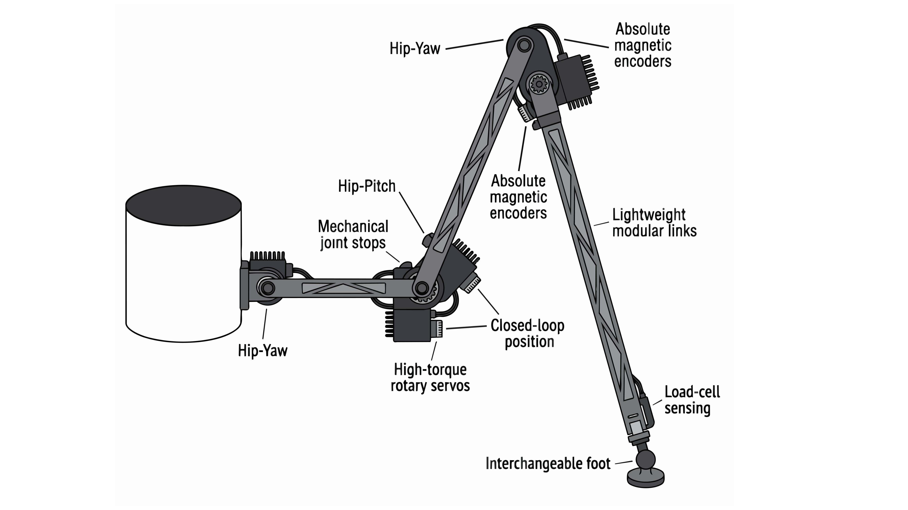
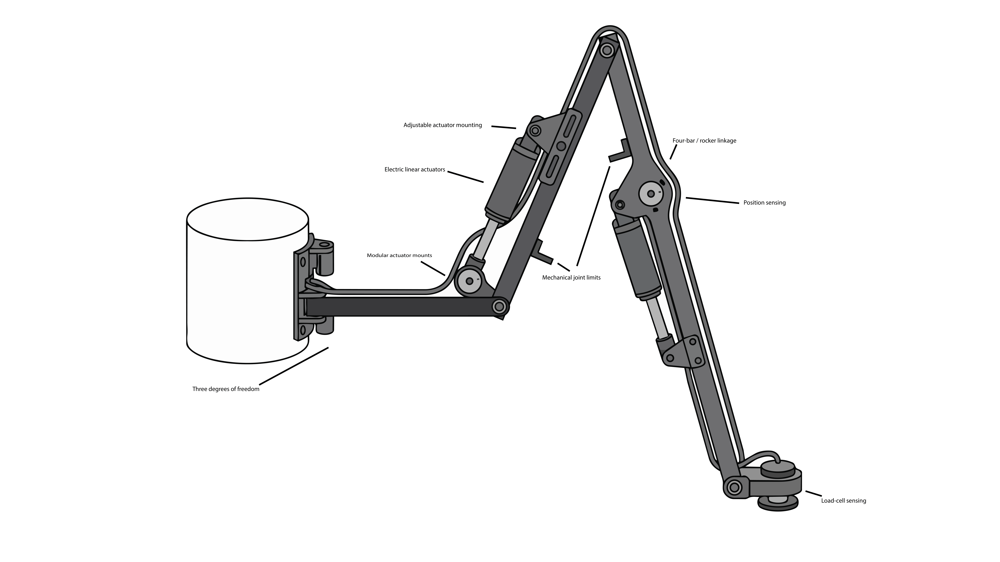
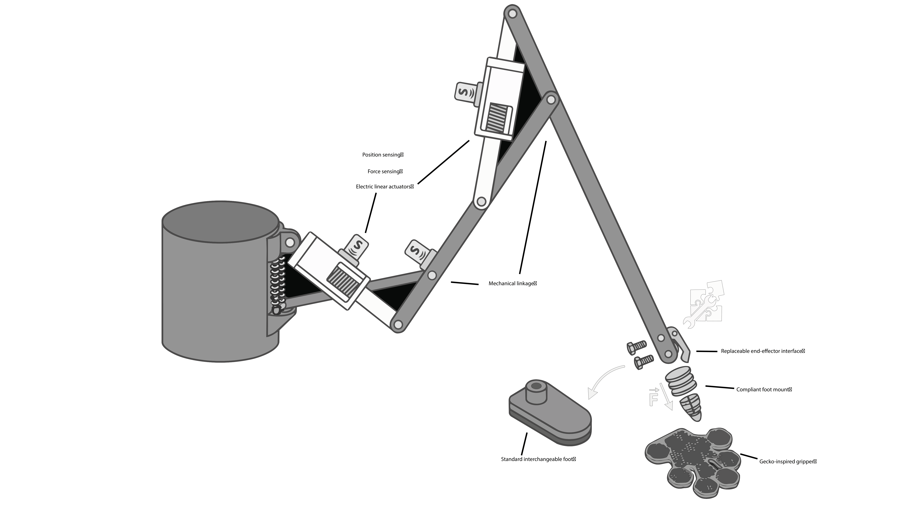

# Ideation and Concept Generation

The purpose of this design ideation phase was to explore a wide range of possible features for a modular robotic leg intended for a six-legged walking robot.

Rather than selecting one design immediately, the team generated approximately 100 individual product features covering joint architecture, actuation, sensing, structural design, foot interaction, modularity, and control. These ideas were grouped, ranked, and combined into three distinct product concepts.

---

## Table of Contents

1. [Project Focus](#project-focus)
2. [Initial Brainstorm](#initial-brainstorm)
   - [Joint Architecture and Kinematics](#joint-architecture-and-kinematics)
   - [Rotary and Linear Actuation](#rotary-and-linear-actuation)
   - [Actuator Mounting and Force Transmission](#actuator-mounting-and-force-transmission)
   - [Position and Motion Feedback](#position-and-motion-feedback)
   - [Foot and Ground Contact](#foot-and-ground-contact)
   - [Gecko Gripper and End-Effector Concepts](#gecko-gripper-and-end-effector-concepts)
   - [Structural Design](#structural-design)
   - [Wiring, Safety, and Control](#wiring-safety-and-control)
3. [Grouping and Ranking](#grouping-and-ranking)
4. [Top Ranked Features](#top-ranked-features)
5. [Complete Feature Ranking](#complete-feature-ranking)
6. [Product Concepts](#product-concepts)
   - [Concept 1: Rotary Servo-Actuated Leg](#concept-1--rotary-servo-actuated-leg)
   - [Concept 2: Electric Linear-Actuator Leg](#concept-2--electric-linear-actuator-leg)
   - [Concept 3: Linear-Actuated Leg with Gecko End Effector](#concept-3--linear-actuated-leg-with-gecko-end-effector)
7. [Concept Comparison](#concept-comparison)
8. [Selected Features Moving Forward](#selected-features-moving-forward)
9. [Brainstorming Process](#brainstorming-process)
10. [Design Ideation Video](#design-ideation-video)

---

# Project Focus

| Design Area | What We Explored |
|---|---|
| **Movement** | Joint geometry, degrees of freedom, and walking range |
| **Actuation** | Servo motors, rotary motors, and linear actuators |
| **Feedback** | Encoders, potentiometers, IMUs, and contact sensors |
| **Ground Interaction** | Foot shape, traction, force sensing, and compliance |
| **Modularity** | Replaceable actuators, links, feet, and end effectors |
| **Structure** | Lightweight and manufacturable leg components |
| **Safety** | Joint limits, stall detection, calibration, and fault handling |

---

# Initial Brainstorm

The initial brainstorm focused on individual product features rather than complete designs. This allowed the team to generate a large design space before deciding which ideas should be combined.

## Joint Architecture and Kinematics

| # | Feature | Purpose |
|---:|---|---|
| 1 | Three-degree-of-freedom leg | Provides hip yaw, hip pitch, and knee pitch |
| 2 | Two-degree-of-freedom leg | Simplifies mechanical and control requirements |
| 3 | Offset hip joint | Increases lateral workspace |
| 4 | Four-bar linkage | Controls foot motion mechanically |
| 5 | Parallel-link knee mechanism | Improves load support |
| 6 | Foot-leveling linkage | Helps keep the foot approximately level |
| 7 | Adjustable upper-leg link | Allows leg geometry to be modified |
| 8 | Adjustable lower-leg link | Allows leg geometry to be modified |
| 9 | Interchangeable link geometry | Supports different stride configurations |
| 10 | Mechanical joint stops | Prevents excessive joint rotation |
| 11 | Adjustable joint-angle limits | Allows range of motion to be changed |
| 12 | Foldable leg configuration | Allows more compact storage |
| 13 | Workspace-optimized joint geometry | Maximizes useful movement |
| 14 | Self-collision optimized spacing | Reduces interference between components |
| 15 | Repeatable walking-arc geometry | Supports consistent walking motion |

[Back to Table of Contents](#table-of-contents)

---

## Rotary and Linear Actuation

| # | Feature | Purpose |
|---:|---|---|
| 16 | High-torque hip servo | Provides powered hip movement |
| 17 | High-torque knee servo | Provides lifting and support |
| 18 | Compact distal servo | Reduces weight farther down the leg |
| 19 | Brushless motor with planetary gearbox | Provides efficient high-torque movement |
| 20 | Geared DC motor with encoder | Combines torque with position feedback |
| 21 | Stepper motor | Provides controlled incremental movement |
| 22 | Worm-drive actuator | Provides high holding torque |
| 23 | Belt-reduction transmission | Moves motor mass closer to the body |
| 24 | Cable-driven joint | Reduces distal actuator weight |
| 25 | Electric linear actuator | Produces controlled linear movement |
| 26 | Linear actuator with four-bar linkage | Converts linear movement into joint rotation |
| 27 | Linear actuator with position feedback | Measures actuator extension |
| 28 | Lead-screw actuator | Provides controlled linear movement |
| 29 | Pneumatic linear actuator | Produces rapid extension and retraction |
| 30 | Double-acting pneumatic cylinder | Provides powered motion in both directions |
| 31 | Pneumatic actuator with flow control | Allows speed adjustment |
| 32 | Hydraulic linear actuator | Produces high-force movement |
| 33 | Hydraulic actuator with pressure sensing | Adds force-related feedback |
| 34 | Spring-assisted actuator | Reduces required motor load |
| 35 | Series-elastic actuator | Adds compliance and impact absorption |

[Back to Table of Contents](#table-of-contents)

---

## Actuator Mounting and Force Transmission

| # | Feature | Purpose |
|---:|---|---|
| 36 | Quick-release actuator bracket | Simplifies actuator replacement |
| 37 | Modular actuator cartridge | Allows the actuator assembly to be replaced separately |
| 38 | Clevis-mounted linear actuator | Provides pivoting actuator attachment |
| 39 | Rocker linkage | Converts actuator movement into joint rotation |
| 40 | Bell-crank mechanism | Changes force direction |
| 41 | Adjustable actuator attachment point | Changes mechanical advantage |
| 42 | Pushrod linkage | Transfers actuator force |
| 43 | Dual-actuator joint | Increases available load capacity |
| 44 | Hip counterbalance spring | Reduces actuator load |
| 45 | Mechanical leverage system | Reduces required actuator force |

---

## Position and Motion Feedback

| # | Feature | Purpose |
|---:|---|---|
| 46 | Absolute magnetic hip encoder | Measures hip position |
| 47 | Absolute magnetic knee encoder | Measures knee position |
| 48 | Incremental encoder with homing | Tracks movement after calibration |
| 49 | Potentiometer joint sensing | Measures joint angle |
| 50 | Hall-effect joint sensing | Provides contactless angle sensing |
| 51 | Linear potentiometer | Measures actuator extension |
| 52 | Joint-output encoder | Measures actual joint position |
| 53 | Calculated joint velocity | Determines movement speed from encoder data |
| 54 | Upper-leg IMU | Measures orientation and motion |
| 55 | Foot-mounted IMU | Measures motion near the ground |
| 56 | Home-position sensor | Establishes a known reference position |
| 57 | End-of-travel sensor | Detects joint or actuator limits |
| 58 | Slip detection | Compares commanded and actual movement |
| 59 | Backlash estimation | Detects mechanical play |
| 60 | Encoder/IMU sensor fusion | Combines multiple feedback sources |

---

## Foot and Ground Contact

| # | Feature | Purpose |
|---:|---|---|
| 61 | Force-sensitive resistor | Detects foot contact |
| 62 | Load cell | Measures ground reaction force |
| 63 | Multiple foot force sensors | Measures force distribution |
| 64 | Contact switch | Provides basic ground detection |
| 65 | Compliant rubber foot | Improves grip and compliance |
| 66 | High-friction foot insert | Improves traction |
| 67 | Rounded foot | Improves contact on uneven surfaces |
| 68 | Wide foot | Supports soft terrain |
| 69 | Narrow foot | Supports hard indoor surfaces |
| 70 | Articulated foot | Passively adjusts to terrain |
| 71 | Spring-loaded foot | Absorbs impacts |
| 72 | Damped foot | Reduces bounce |
| 73 | Interchangeable feet | Allows terrain-specific configurations |
| 74 | Toe-style climbing tip | Assists with obstacles |
| 75 | Anti-slip foot geometry | Improves stance stability |

---

## Gecko Gripper and End-Effector Concepts

| # | Feature | Purpose |
|---:|---|---|
| 76 | Gecko-inspired adhesive foot | Provides additional surface attachment |
| 77 | Gecko gripper end effector | Allows specialized gripping |
| 78 | Interchangeable gecko module | Preserves modularity |
| 79 | Passive gecko adhesive pad | Adds attachment without active control |
| 80 | Active gecko gripper | Allows controlled engagement |
| 81 | Directional gecko surface | Provides directional adhesion |
| 82 | Compliant gecko mount | Improves surface contact |
| 83 | Gecko pad with force sensing | Combines gripping and feedback |
| 84 | Hybrid rubber/gecko foot | Combines traction and adhesion |
| 85 | Replaceable end-effector interface | Allows multiple foot attachments |

---

## Structural Design

| # | Feature | Purpose |
|---:|---|---|
| 86 | Aluminum upper-leg link | Provides lightweight structural support |
| 87 | Aluminum lower-leg link | Provides lightweight structural support |
| 88 | Carbon-fiber link with printed fittings | Reduces weight |
| 89 | Reinforced 3D-printed nylon link | Balances cost and strength |
| 90 | Fiber-reinforced polymer | Provides lightweight structural support |
| 91 | Hollow structural members | Reduces mass |
| 92 | Ribbed printed geometry | Improves stiffness |
| 93 | Topology-optimized link | Removes unnecessary material |
| 94 | Removable side plates | Improves maintenance access |
| 95 | Heat-set threaded inserts | Strengthens reusable fastener locations |

---

## Wiring, Safety, and Control

| # | Feature | Purpose |
|---:|---|---|
| 96 | Internal cable routing | Protects wiring |
| 97 | Strain relief | Protects wires near moving joints |
| 98 | Motor-current sensing | Detects stalls and overloads |
| 99 | Automatic startup calibration | Establishes known starting positions |
| 100 | Closed-loop control with fault state | Controls motion and handles faults |

---

# Brainstorm Snapshot

The image below shows the brainstorm before the features were finalized into product concepts.

[Back to Table of Contents](#table-of-contents)

---

# Grouping and Ranking

After the initial brainstorm, related features were grouped according to their primary purpose.

| Group | Main Question |
|---|---|
| **Joint Architecture** | How should the leg move? |
| **Actuation** | What should create the movement? |
| **Force Transmission** | How should actuator force reach the joints? |
| **Feedback** | How will the robot know where the leg is? |
| **Ground Contact** | How will the foot interact with the surface? |
| **End Effectors** | What specialized attachments could be used? |
| **Structure** | How can the leg remain strong and lightweight? |
| **Control & Safety** | How will motion remain controlled and protected? |

The team then ranked the features based on their importance to basic leg operation and their usefulness in future concept development.

---

# Top Ranked Features

| Rank | Feature | Why It Ranked Highly |
|---:|---|---|
| **1** | Three-degree-of-freedom leg | Provides useful spider-like motion |
| **2** | High-torque hip servo | Supports a significant portion of the leg load |
| **3** | High-torque knee servo | Provides lifting and stance support |
| **4** | Absolute magnetic hip encoder | Provides reliable hip-position feedback |
| **5** | Absolute magnetic knee encoder | Provides reliable knee-position feedback |
| **6** | Closed-loop position control | Improves movement accuracy and safety |
| **7** | Mechanical joint stops | Protects the mechanism |
| **8** | Ground-force load cell | Determines whether the foot is supporting weight |
| **9** | Interchangeable foot design | Supports multiple surfaces and experiments |
| **10** | Modular actuator cartridge | Simplifies testing and repair |
| **11** | Workspace-optimized geometry | Improves useful movement |
| **12** | Motor-current sensing | Detects stalls and jams |
| **13** | Reinforced printed structure | Balances strength, cost, and manufacturing |
| **14** | Startup calibration | Creates a known starting position |
| **15** | Adjustable actuator attachment | Allows torque/speed tradeoffs to be tested |

---

# Complete Feature Ranking

## Ranks 16–30 — Very Strong Features

| Rank | Feature |
|---:|---|
| 16 | Electric linear actuator |
| 17 | Linear actuator with position feedback |
| 18 | Linear actuator with four-bar linkage |
| 19 | Four-bar linkage |
| 20 | Adjustable joint-angle limits |
| 21 | Joint-output encoder |
| 22 | Home-position sensor |
| 23 | Quick-release actuator bracket |
| 24 | Low-friction joint support |
| 25 | Adjustable upper-leg link |
| 26 | Adjustable lower-leg link |
| 27 | Compliant rubber foot |
| 28 | Strain relief |
| 29 | Internal cable routing |
| 30 | Spring-assisted actuator |

## Ranks 31–40 — Alternative Actuation

| Rank | Feature |
|---:|---|
| 31 | Pneumatic linear actuator |
| 32 | Double-acting pneumatic cylinder |
| 33 | Pneumatic flow control |
| 34 | Hydraulic linear actuator |
| 35 | Hydraulic pressure sensing |
| 36 | Geared DC motor with encoder |
| 37 | Brushless motor with planetary gearbox |
| 38 | Worm-drive actuator |
| 39 | Lead-screw actuator |
| 40 | Series-elastic actuator |

## Ranks 41–54 — Sensors and Feedback

| Rank | Feature |
|---:|---|
| 41 | Hall-effect joint sensing |
| 42 | Linear potentiometer |
| 43 | Rotary potentiometer |
| 44 | Upper-leg IMU |
| 45 | Foot IMU |
| 46 | Force-sensitive resistor |
| 47 | Multiple foot force sensors |
| 48 | End-of-travel sensor |
| 49 | Slip detection |
| 50 | Sensor fusion |
| 51 | Joint velocity calculation |
| 52 | Backlash estimation |
| 53 | Ground-contact switch |
| 54 | Incremental encoder |

## Ranks 55–64 — Gecko / End Effector

| Rank | Feature |
|---:|---|
| 55 | Interchangeable gecko module |
| 56 | Gecko gripper |
| 57 | Gecko-inspired adhesive foot |
| 58 | Compliant gecko mount |
| 59 | Gecko pad with force sensing |
| 60 | Replaceable end-effector interface |
| 61 | Hybrid rubber/gecko foot |
| 62 | Active gecko gripper |
| 63 | Directional gecko surface |
| 64 | Passive gecko pad |

## Ranks 65–80 — Mechanical Structure

| Rank | Feature |
|---:|---|
| 65 | Rocker linkage |
| 66 | Bell-crank mechanism |
| 67 | Pushrod linkage |
| 68 | Mechanical leverage system |
| 69 | Counterbalance spring |
| 70 | Parallel-link knee |
| 71 | Aluminum upper-leg link |
| 72 | Aluminum lower-leg link |
| 73 | Hollow members |
| 74 | Ribbed printed structure |
| 75 | Heat-set inserts |
| 76 | Removable side plates |
| 77 | Interchangeable link geometry |
| 78 | Structural guards |
| 79 | Topology-optimized link |
| 80 | Carbon-fiber link |

## Ranks 81–90 — Specialized Features

| Rank | Feature |
|---:|---|
| 81 | Articulated foot |
| 82 | Spring-loaded foot |
| 83 | Damped foot |
| 84 | High-friction insert |
| 85 | Wide terrain foot |
| 86 | Rounded terrain foot |
| 87 | Toe-style climbing tip |
| 88 | Anti-slip geometry |
| 89 | Narrow indoor foot |
| 90 | Compact distal servo |

## Ranks 91–100 — Experimental Features

| Rank | Feature |
|---:|---|
| 91 | Cable-driven joint |
| 92 | Belt-reduction transmission |
| 93 | Dual-actuator joint |
| 94 | Two-degree-of-freedom leg |
| 95 | Foldable leg |
| 96 | Offset hip |
| 97 | Foot-leveling linkage |
| 98 | Fiber-reinforced polymer |
| 99 | Self-collision optimized spacing |
| 100 | Predetermined walking-arc geometry |

[Back to Table of Contents](#table-of-contents)

---

# Product Concepts

The ranked features were recombined into three distinct design concepts.

## Concept 1 — Rotary Servo-Actuated Leg

| Design Area | Selected Feature |
|---|---|
| **Architecture** | Three-degree-of-freedom leg |
| **Actuation** | High-torque rotary servos |
| **Feedback** | Absolute magnetic encoders |
| **Control** | Closed-loop position control |
| **Safety** | Mechanical joint stops |
| **Ground Detection** | Load-cell sensing |
| **Foot** | Interchangeable foot |
| **Structure** | Lightweight modular links |

This concept uses rotary actuators directly at the main joints and emphasizes accurate joint positioning and straightforward control.

---

## Concept 2 — Electric Linear-Actuator Leg

| Design Area | Selected Feature |
|---|---|
| **Architecture** | Three-degree-of-freedom leg |
| **Actuation** | Electric linear actuators |
| **Transmission** | Four-bar / rocker linkage |
| **Adjustment** | Adjustable actuator mounting |
| **Feedback** | Position sensing |
| **Safety** | Mechanical joint limits |
| **Ground Detection** | Load-cell sensing |
| **Maintenance** | Modular actuator mounts |

This concept converts linear actuator extension and retraction into rotational joint movement through mechanical linkages.

---

## Concept 3 — Linear-Actuated Leg with Gecko End Effector

| Design Area | Selected Feature |
|---|---|
| **Actuation** | Electric linear actuators |
| **Transmission** | Mechanical linkage |
| **Feedback** | Position sensing |
| **End Effector** | Gecko-inspired gripper |
| **Modularity** | Replaceable end-effector interface |
| **Compliance** | Compliant foot mount |
| **Ground Detection** | Force sensing |
| **Alternate Foot** | Standard interchangeable foot |

This concept combines linear actuation with a modular gecko-inspired end effector for specialized surface interaction.

[Back to Table of Contents](#table-of-contents)

---

# Concept Comparison

| Feature | Concept 1 | Concept 2 | Concept 3 |
|---|:---:|:---:|:---:|
| 3-DOF Architecture | ✓ | ✓ | ✓ |
| Rotary Servo Actuation | ✓ | — | — |
| Linear Actuation | — | ✓ | ✓ |
| Position Feedback | ✓ | ✓ | ✓ |
| Closed-Loop Control | ✓ | ✓ | ✓ |
| Mechanical Joint Protection | ✓ | ✓ | ✓ |
| Ground Sensing | ✓ | ✓ | ✓ |
| Modular Foot | ✓ | ✓ | ✓ |
| Mechanical Linkage | — | ✓ | ✓ |
| Gecko End Effector | — | — | ✓ |

---

# Selected Features Moving Forward

The following features remained useful across multiple concepts and will continue to be considered during future design development.

| Area | Selected Direction |
|---|---|
| **Movement** | Three-degree-of-freedom architecture |
| **Feedback** | Joint-position sensing |
| **Control** | Closed-loop motion control |
| **Safety** | Mechanical joint limits |
| **Ground Interaction** | Contact or force sensing |
| **Modularity** | Replaceable actuator and foot systems |
| **Structure** | Lightweight components |
| **Wiring** | Protected cable routing |
| **Startup** | Automatic calibration |
| **Adaptability** | Interchangeable end effectors |

---

# Brainstorming Process

A separate page documents how the brainstorming session was conducted, including:

- Who participated
- How the team met
- How ideas were collected
- Which project requirements were used
- Additional resources used during ideation
- How the features were grouped
- How rankings were assigned

[View the Brainstorming Process](brainstorming-process.md)

---

---

[Back to Table of Contents](#table-of-contents)