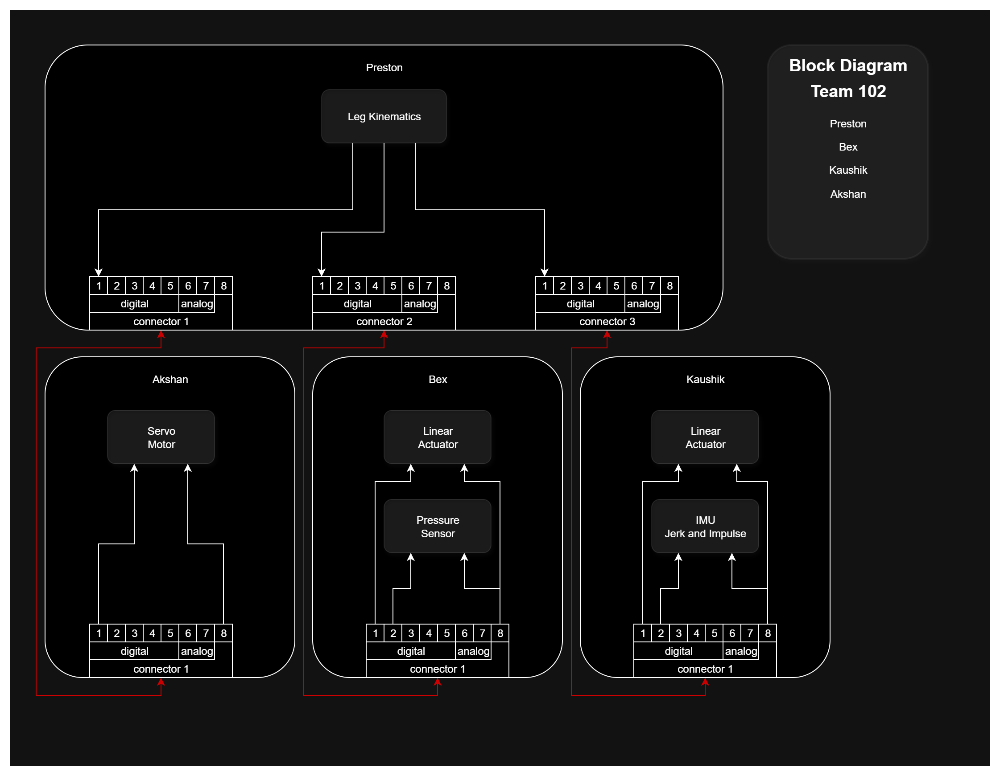

## Team Block Diagram

The modular spider leg is split across four teammates' boards, connected in a **hub-and-spoke** layout with 8-pin ribbon cables. Preston's board is the hub. It runs the leg kinematics and connects to each of the other three boards through its own connector.

  
**Figure 1:** Team 102 hub-and-spoke block diagram. Preston's leg kinematics board (top) connects to Akshan, Bex, and Kaushik (bottom).

[Download the draw.io source file](images/team-block-diagram.drawio)

## Subsystem Responsibilities

| Teammate | Role | Subsystem Hardware | Hub Connector |
|---|---|---|---|
| Preston Potts | Hub: leg kinematics | Computes leg kinematics and sends commands to the three spoke boards | Connectors 1, 2, and 3 |
| Akshan Bhelkar | Spoke | Servo motor | Hub connector 1 |
| Bex Baker | Spoke | Linear actuator, pressure sensor | Hub connector 2 |
| Kaushik Gunasekaren | Spoke | Linear actuator, IMU (jerk and impulse sensing) | Hub connector 3 |

## Connection Layout

Each spoke board has one 2x4 ribbon connector (connector 1). The cable runs back to its own connector on Preston's hub board. Every link uses the class-standard pinout: pins 1&ndash;5 digital, pins 6&ndash;7 analog, pin 8 ground.

| Pin | Type | Preston &harr; Akshan (Hub Conn 1) | Preston &harr; Bex (Hub Conn 2) | Preston &harr; Kaushik (Hub Conn 3) |
|:---:|---|---|---|---|
| 1 | Digital | Leg kinematics &rarr; servo motor command | Leg kinematics &rarr; linear actuator command | Leg kinematics &rarr; linear actuator command |
| 2 | Digital | Not used | Pressure sensor signal | IMU (jerk / impulse) signal |
| 3 | Digital | Not used | Not used | Not used |
| 4 | Digital | Not used | Not used | Not used |
| 5 | Digital | Not used | Not used | Not used |
| 6 | Analog | Not used | Not used | Not used |
| 7 | Analog | Not used | Not used | Not used |
| 8 | GND | Common ground | Common ground | Common ground |

## Design Discussion

**Minimizing interconnections.** Each spoke needs at most two signal pins plus ground: one for the actuator command and one for sensor feedback. That leaves pins 3&ndash;7 free on every cable for future signals.

**Why hub and spoke.** The kinematics have to coordinate every joint of the leg, so it makes sense for one central board to compute them and send commands out to the actuator boards. Each spoke has its own direct cable to the hub, so a fault on one spoke's cable doesn't cut off the other spokes.

**Risk of losing a teammate.** If a spoke board is lost, only that joint or sensor is affected, and the rest of the leg can still be commanded. The hub is the single point of failure: without Preston's board, no kinematics commands are generated. To reduce that risk, the kinematics code should be written so it can be moved onto another teammate's microcontroller if needed.

## Message Structure

The message format between the hub and the spoke boards will be defined in the upcoming software/message-structure assignment.
